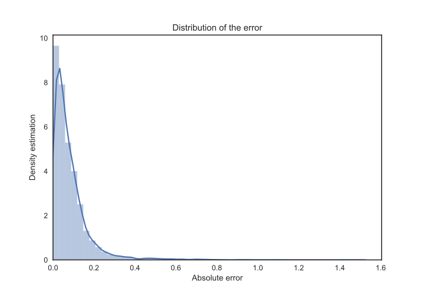

# Girolami

This is a simple implementation of [Girolami's method](http://pubs.acs.org/doi/abs/10.1021/ed071p962), a very simple technique to estimate the density of a liquid compound based on *group contributions*. Although a bit crude, it has shown very good results.

The following results follow from the comparison with a [density dataset](http://krakenminer.com/onewebmedia/dset/DENSITY_MOLS.zip) originally elaborated by US Environmental Protection Agency.

|               |               | 
| ------------- |:-------------:|
| __Mean error__    | 0.082 g·cm-3  |
| __Std. dev.__     | 0.095 g·cm-3  |
| __Maximum error__  | 1.479 g·cm-3  |

